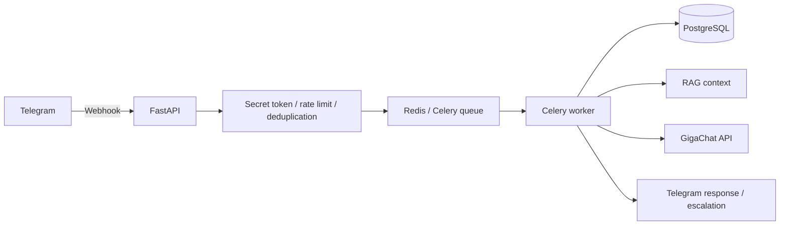

# TATTOTOYOU — AI-ассистент для тату-студии

[](https://github.com/bsekinaev/tattotoyou/actions/workflows/ci.yml)


Telegram-ассистент для обработки типовых обращений клиентов тату-студии. Сервис принимает webhook-события, определяет сценарий обращения, формирует ответ с помощью GigaChat и передаёт сложные или чувствительные случаи мастеру.

> **Статус:** portfolio MVP в стадии стабилизации надёжности. Основной пользовательский и инфраструктурный контур реализован; Inbox/Outbox и гарантированная исходящая доставка находятся в roadmap.

## Задача проекта

Тату-мастеру регулярно поступают повторяющиеся вопросы о стоимости, стилях, подготовке и уходе. TATTOTOYOU автоматизирует первичную обработку таких обращений, при этом не пытается самостоятельно решать медицинские и конфликтные ситуации.

Проект демонстрирует:

- событийную обработку Telegram webhook'ов;
- фоновые задачи и взаимодействие с внешним AI API;
- хранение данных в PostgreSQL;
- rate limiting, дедупликацию и защиту чувствительных данных;
- тестирование, контейнеризацию и автоматические проверки.

## Реализовано

- приём Telegram webhook-событий через FastAPI;
- проверка Telegram Secret Token;
- постановка длительной обработки в Celery через Redis;
- интеграция с GigaChat по OAuth2;
- RAG-контекст из базы знаний;
- keyword-based классификация типовых намерений;
- эскалация медицинских, токсичных и нестандартных запросов мастеру;
- Redis rate limiter на Lua-скрипте;
- маскирование персональных данных перед вызовом внешнего AI API;
- обязательная TLS-верификация для GigaChat;
- `/live`, `/ready` и `/health` для проверки состояния сервиса;
- структурированное логирование;
- миграции Alembic;
- Docker Compose и GitHub Actions.

## Архитектура



Приложение разделено на API-слой, сервисы, репозитории и фоновые задачи. FastAPI выполняет быструю валидацию входящего события и передаёт длительную работу Celery-воркеру.

## Ключевые инженерные решения

### Асинхронная обработка webhook'ов

Вызов внешнего AI API может занимать заметное время. Webhook-обработчик не ожидает генерацию ответа, а ставит задачу в Celery. Это сокращает время удержания HTTP-соединения и отделяет транспортный слой от бизнес-логики.

### Rate limiting до очереди

Ограничение частоты применяется до `task.delay()`. Счётчик реализован через Lua в Redis, поэтому изменение значения и установка TTL выполняются атомарно.

### Работа с чувствительными данными

Перед передачей текста внешнему AI-провайдеру выполняется маскирование персональных данных. Непроверенные данные профиля изолируются от системных инструкций.

### Отказоустойчивость внешней интеграции

Для временных ошибок предусмотрены retry/backoff и fallback-ответ. Полная идемпотентность на PostgreSQL и гарантированная исходящая доставка развиваются отдельно и явно отмечены в roadmap.

## Технологический стек

| Область | Технологии |
|---|---|
| Backend | Python 3.12, FastAPI, Pydantic v2 |
| Database | PostgreSQL 15, SQLAlchemy 2.0 async, Alembic |
| Queue / cache | Celery, Redis |
| AI | GigaChat API, OAuth2, RAG |
| HTTP | httpx |
| Tests | pytest, pytest-asyncio, pytest-cov |
| Quality | Ruff, GitHub Actions |
| Infrastructure | Docker, Docker Compose |
| Logging | structlog |

## Быстрый запуск

### 1. Подготовка конфигурации

```bash
cp .env.example .env
```

Заполните обязательные переменные для PostgreSQL, Redis, Telegram, GigaChat и Admin API. Секреты и сертификаты не должны попадать в репозиторий.

### 2. Запуск полного стека

```bash
docker compose \
  -f docker-compose.yml \
  -f docker-compose.dev.yml \
  up --build
```

### 3. Миграции

```bash
python -m alembic upgrade head
```

### 4. Локальный запуск API и worker

```bash
python -m uvicorn app.main:app --reload --reload-dir src
```

```bash
python -m celery -A app.workers.celery_app:celery_app worker --loglevel=info --pool=solo
```

`--pool=solo` используется для локального запуска на Windows. В Linux можно использовать стандартный prefork pool.

## Проверка состояния

```text
GET /live   # процесс приложения работает
GET /ready  # PostgreSQL и Redis доступны
GET /health # совместимый alias для /ready
```

Readiness-ответ не раскрывает внутренние тексты инфраструктурных исключений.

## Тестирование

```bash
python -m pytest tests/unit -v --cov=src/app
```

Unit-тесты проверяют классификацию запросов, эскалацию, изоляцию prompt metadata, аутентификацию Admin API, webhook secret, TLS, PII-redaction и health endpoints.

Интеграционные проверки PostgreSQL и конкурентных инвариантов запускаются отдельно на реальной тестовой базе.

## Безопасность

- Telegram Secret Token проверяется до обработки события;
- Admin API принимает ключ через заголовок `X-Admin-Key`;
- TLS-проверка внешнего AI API не отключается;
- сертификаты и секреты не коммитятся;
- базовый Docker Compose не публикует PostgreSQL и Redis наружу;
- исходящие HTTP-клиенты не наследуют случайную системную proxy-конфигурацию по умолчанию.

## Ограничения и roadmap

- [x] Telegram webhook и Celery pipeline
- [x] PostgreSQL, Redis и Alembic
- [x] GigaChat и RAG
- [x] rate limiting и PII-redaction
- [x] health endpoints и CI
- [ ] PostgreSQL Inbox/Outbox
- [ ] гарантированная исходящая доставка и отдельный outbound retry
- [ ] административный интерфейс оператора
- [ ] расширенные интеграционные и нагрузочные тесты
- [ ] метрики и dashboard observability

## Автор

**Батраз Секинаев** — Python Backend Developer

[GitHub](https://github.com/bsekinaev) · [Telegram](https://t.me/bsekinaev)
