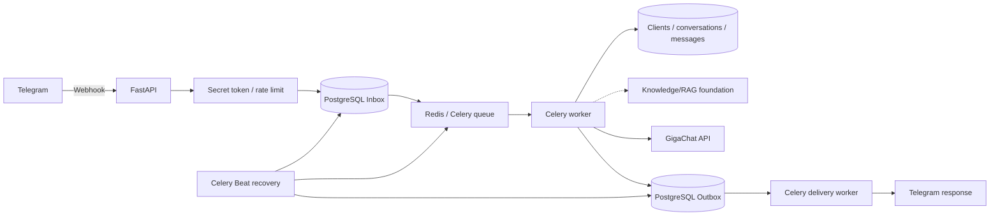

# TATTOTOYOU — AI-ассистент для тату-студии

[](https://github.com/bsekinaev/tattotoyou/actions/workflows/ci.yml)


Telegram-ассистент для обработки типовых обращений клиентов тату-студии. Сервис принимает webhook-события, определяет сценарий обращения, формирует ответ с помощью GigaChat и передаёт сложные или чувствительные случаи мастеру.

> **Статус:** рабочий product MVP. Надёжный Telegram/AI-контур, активный RAG, панель Сони, CRM-карточка клиента, заявки на тату и управление записью реализованы.

## Задача проекта

Тату-мастеру регулярно поступают повторяющиеся вопросы о стоимости, стилях, подготовке и уходе. TATTOTOYOU автоматизирует первичную обработку таких обращений, при этом не пытается самостоятельно решать медицинские и конфликтные ситуации.

Проект демонстрирует:

- событийную обработку Telegram webhook'ов;
- фоновые задачи и взаимодействие с внешним AI API;
- хранение данных в PostgreSQL;
- rate limiting, дедупликацию и защиту чувствительных данных;
- тестирование, контейнеризацию и автоматические проверки.

## Реализовано

- приём Telegram webhook-событий через FastAPI;
- проверка Telegram Secret Token;
- долговечная фиксация входящих событий в PostgreSQL до постановки в Celery;
- идемпотентная обработка повторных Telegram update и recovery зависших событий;
- Transactional Outbox для исходящих сообщений, повтор доставки и ручной replay failed-записей;
- handoff-состояния диалога `active`, `escalated`, `human_owned`, `closed`;
- интеграция с GigaChat по OAuth2, типизированные ошибки, bounded retry и distributed token refresh lock;
- управляемая база знаний, pgvector retrieval, lifecycle embeddings и безопасный fallback при отсутствии подтверждённых фактов;
- keyword-based классификация типовых намерений;
- эскалация медицинских, токсичных и нестандартных запросов мастеру;
- Redis rate limiter на Lua-скрипте;
- маскирование телефонов и email перед вызовом внешнего AI API;
- обязательная TLS-верификация для GigaChat;
- ограничение истории/ответа AI, fallback с эскалацией и блокировка ответов banned-клиентам;
- loop-local SQLAlchemy engine для Celery-задач и разбиение длинного Telegram plain-text;
- `/live`, `/ready` и `/health` для проверки состояния сервиса;
- структурированное логирование;
- миграции Alembic;
- встроенная панель Сони с CRM-карточкой, заявками на тату и расписанием;
- Docker Compose и многоступенчатый GitHub Actions quality gate;
- зафиксированное окружение зависимостей через `uv.lock`.

## Архитектура


```mermaid
flowchart LR
    TG[Telegram] -->|Webhook| API[FastAPI]
    API --> SEC[Secret token / rate limit]
    SEC --> INBOX[(PostgreSQL Inbox)]
    INBOX --> Q[Redis / Celery queue]
    BEAT[Celery Beat recovery] --> INBOX
    BEAT --> Q
    Q --> W[Celery worker]
    W --> DB[(Clients / conversations / messages)]
    W -.-> RAG[Knowledge/RAG foundation]
    W --> AI[GigaChat API]
    W --> OUTBOX[(PostgreSQL Outbox)]
    BEAT --> OUTBOX
    OUTBOX --> SENDER[Celery delivery worker]
    SENDER --> OUT[Telegram response]
```

Приложение разделено на API-слой, сервисы, репозитории и фоновые задачи. FastAPI валидирует событие, атомарно сохраняет его в PostgreSQL Inbox и только после commit пытается передать UUID события Celery-воркеру. Бизнес-ответ и запись `outbound_deliveries` сохраняются в одной транзакции; отдельный delivery worker отправляет сообщение в Telegram. Ошибка брокера или временная ошибка Telegram не теряет работу: Celery Beat повторно ставит готовые Inbox- и Outbox-записи в очередь.

## Ключевые инженерные решения

### Асинхронная обработка webhook'ов

Вызов внешнего AI API может занимать заметное время. Webhook-обработчик не ожидает генерацию ответа, а ставит задачу в Celery. Это сокращает время удержания HTTP-соединения и отделяет транспортный слой от бизнес-логики.

### Rate limiting до очереди

Ограничение частоты применяется до `task.delay()`. Счётчик реализован через Lua в Redis, поэтому изменение значения и установка TTL выполняются атомарно.

### PostgreSQL Inbox и идемпотентность

Пара `(platform, external_event_id)` уникальна, поэтому повторная доставка Telegram update возвращает существующее событие. Воркер захватывает событие через `FOR UPDATE SKIP LOCKED`, увеличивает счётчик попыток и переводит его в `processing`. Ошибки переводят событие в `retrying` с exponential backoff, а превышение лимита — в `failed`.

Каждый Inbox event может породить максимум одно входящее и одно исходящее сообщение благодаря частичному уникальному индексу `(causation_event_id, direction)`. Это устраняет повторную запись бизнес-ответа при повторном запуске Celery-задачи.

### Transactional Outbox и исходящая доставка

Исходящее `Message` и единственная связанная запись `outbound_deliveries` создаются в одной PostgreSQL-транзакции. Delivery worker захватывает запись через `FOR UPDATE SKIP LOCKED`, переводит её в `sending`, сохраняет Telegram `message_id` после успеха и классифицирует ошибки на временные и постоянные. Временные ошибки получают exponential backoff, постоянные HTTP 4xx переходят в `failed`; администратор может вернуть failed-доставку в `pending` через закрытый endpoint.

Система обеспечивает **at-least-once delivery** при единственном бизнес-ответе в PostgreSQL. Telegram Bot API не принимает idempotency key для `sendMessage`, поэтому в редком окне падения процесса после успешной отправки, но до фиксации `sent`, возможна повторная доставка на платформе. Это ограничение явно учитывается в эксплуатации и наблюдаемости.

### Передача диалога человеку

После медицинской, конфликтной или явно запрошенной эскалации диалог переходит из `active` в `escalated`. Последующие сообщения клиента сохраняются, но AI больше не отвечает. Закрытый Admin API позволяет перевести диалог в `human_owned`, вернуть его в `active` или закрыть. Частичный уникальный индекс гарантирует не более одного открытого диалога клиента среди `active`, `escalated` и `human_owned`.

### Работа с чувствительными данными

Перед передачей истории внешнему AI-провайдеру телефоны и email заменяются безопасными маркерами. Оригинальный текст остаётся в собственной PostgreSQL. Непроверенные данные профиля изолируются от системных инструкций.

### Отказоустойчивость внешней интеграции

Inbox и Outbox сохраняют работу до обращения к Redis, Telegram и GigaChat. Исходящие ошибки Telegram классифицируются на временные и постоянные, а recovery выполняется Celery Beat. GigaChat различает authentication, rate limit, timeout, transport, 5xx и invalid-response ошибки; повторяются только временные сбои с bounded exponential backoff и jitter. После `401` отклонённый token сбрасывается и обновляется один раз, а Redis-lock предотвращает параллельный refresh несколькими worker.

После исчерпания AI-попыток создаётся обычный fallback-ответ через Transactional Outbox, диалог переводится в `escalated`, а Соне отправляется уведомление без технических деталей и секретов. История ограничивается числом сообщений и символов. Celery использует loop-local SQLAlchemy engine с `NullPool`, поэтому соединения не переиспользуются между отдельными `asyncio.run`.

## Технологический стек

| Область | Технологии |
|---|---|
| Backend | Python 3.12, FastAPI, Pydantic v2 |
| Database | PostgreSQL 15, SQLAlchemy 2.0 async, Alembic |
| Queue / cache | Celery, Redis |
| AI | GigaChat API, OAuth2, sentence-transformers, pgvector/RAG |
| HTTP | httpx |
| Tests | pytest, pytest-asyncio, pytest-cov |
| Quality | Ruff, uv lock, GitHub Actions, coverage gate |
| Infrastructure | Docker, Docker Compose |
| Logging | structlog |

## Быстрый запуск

### 1. Подготовка конфигурации

```bash
cp .env.example .env
```

Заполните обязательные переменные для PostgreSQL, Redis, Telegram, GigaChat и Admin API. Секреты и сертификаты не должны попадать в репозиторий. Безопасно проверить заполнение можно командой `python scripts/check_configuration.py`; значения секретов она не выводит.

### 2. Запуск полного стека

```bash
docker compose \
  -f docker-compose.yml \
  -f docker-compose.dev.yml \
  up --build
```

### 3. Миграции

```bash
python -m alembic upgrade head
```

### 4. Локальный запуск API и worker

```bash
python -m uvicorn app.main:app --reload --reload-dir src
```

```bash
python -m celery -A app.workers.celery_app:celery_app worker --loglevel=info --pool=solo
```

В отдельном терминале запустите recovery-планировщик:

```bash
python -m celery -A app.workers.celery_app:celery_app beat --loglevel=info
```

`--pool=solo` используется для локального запуска worker на Windows. В Linux можно использовать стандартный prefork pool.

## Проверка состояния

```text
GET /live   # процесс приложения работает
GET /ready  # PostgreSQL и Redis доступны
GET /health # совместимый alias для /ready
```

Readiness-ответ не раскрывает внутренние тексты инфраструктурных исключений.

## Тестирование и quality gates

Установить воспроизводимое окружение из lock-файла:

```bash
uv sync --locked --extra dev
```

Запустить unit-тесты с текущим минимальным порогом покрытия 74%:

```bash
uv run --locked --extra dev python -m pytest tests/unit -v \
  --cov=src/app --cov-report=term-missing --cov-fail-under=74
```

Unit-тесты проверяют 169 размеченных клиентских фраз, confidence классификатора, prompt-injection detector, расширенную эскалацию, state machine диалога, Transactional Outbox для ответов и уведомлений Соне, retry/refresh GigaChat, bounded prompt, AI fallback, banned-клиентов, loop-local DB session, Telegram chunking, аутентификацию Admin API, webhook secret, TLS, минимизацию PII, PostgreSQL Inbox и health endpoints.

Проверить линейность Alembic-истории без подключения к БД:

```bash
uv run --locked --extra dev python scripts/check_migration_graph.py
```

Интеграционные тесты требуют чистую PostgreSQL с расширением pgvector. Кроссплатформенный runner сам поднимает инфраструктуру, пересоздаёт только выделенную тестовую БД, применяет миграции и запускает suite:

```bash
uv run --no-sync python scripts/run_postgres_integration.py
```

По умолчанию используется БД `tattoo_assistant_test`. Основная локальная БД не удаляется и не изменяется.

GitHub Actions теперь выполняет три независимых уровня проверки:

1. Python 3.11/3.12 — syntax, Ruff, единый Alembic head и unit coverage gate.
2. PostgreSQL 15 + pgvector и Redis — миграции с пустой БД и integration-тесты конкурентных инвариантов.
3. Docker — валидация production/development Compose, сборка образа строго из `uv.lock` и import/config smoke-test.

Строгий `mypy` остаётся отдельным диагностическим этапом до планового погашения накопленного type debt:

```bash
python scripts/validate_repository.py --type-check
```

## Backend API оператора

Все endpoints требуют заголовок `X-Admin-Key`:

```text
GET  /admin/conversations?status=escalated
POST /admin/conversations/{id}/takeover
POST /admin/conversations/{id}/return-to-ai
POST /admin/conversations/{id}/close
GET  /admin/deliveries?status=failed
POST /admin/deliveries/{id}/retry
```

Эти endpoints используются встроенной панелью Сони и остаются доступны для внешних интеграций.

## База знаний и RAG

Admin API автоматически создаёт или обновляет embedding при изменении вопроса, ответа или ключевых слов:

```text
GET    /admin/knowledge
POST   /admin/knowledge
GET    /admin/knowledge/{id}
PATCH  /admin/knowledge/{id}
DELETE /admin/knowledge/{id}
```

Существующие записи после обновления приложения нужно проиндексировать:

```bash
python scripts/backfill_knowledge_embeddings.py
```

Для полного пересчёта:

```bash
python scripts/backfill_knowledge_embeddings.py --force
```

RAG использует cosine similarity в pgvector. Для намерений `pricing`, `booking`, `aftercare` и `portfolio` отсутствие релевантной записи не приводит к выдуманному ответу: диалог эскалируется Соне. При временной недоступности embedding-модели применяется консервативный keyword fallback. Первый запуск sentence-transformers может скачать модель; в production образ устанавливается с extra `rag`.

## Безопасность

- тело Telegram webhook ограничивается до JSON/Pydantic-парсинга;
- Telegram Secret Token проверяется до бизнес-обработки события;
- Admin API принимает ключ через заголовок `X-Admin-Key`;
- TLS-проверка внешнего AI API не отключается;
- сертификаты и секреты не коммитятся;
- базовый Docker Compose не публикует PostgreSQL и Redis наружу;
- исходящие HTTP-клиенты не наследуют случайную системную proxy-конфигурацию по умолчанию.

## Ограничения и roadmap

- [x] Telegram webhook и Celery pipeline
- [x] PostgreSQL, Redis и Alembic
- [x] GigaChat OAuth2, pgvector и lifecycle embeddings
- [x] активный RAG-пайплайн с relevance threshold и keyword fallback
- [x] rate limiting и PII-redaction
- [x] health endpoints и CI
- [x] PostgreSQL Inbox и идемпотентная обработка входящих событий
- [x] Transactional Outbox, at-least-once исходящая доставка и outbound retry
- [x] backend-команды handoff и replay доставки
- [x] typed errors GigaChat, bounded retry, token refresh lock и AI fallback
- [x] loop-local DB engine для Celery и лимиты контекста/ответа
- [x] административный интерфейс оператора
- [x] заявки на тату, state machine воронки и управление записью
- [x] PostgreSQL integration-тесты и migration smoke в CI
- [x] explainable intent classifier с confidence и regression dataset
- [x] prompt-injection detector и расширенные safety-эскалации
- [x] долговечные уведомления Соне и terminal fallback через Outbox
- [ ] нагрузочные, e2e и chaos-тесты
- [ ] метрики и dashboard observability

## Панель Сони

После применения миграций мастер может работать с клиентами через встроенную
web-панель без отдельного frontend-приложения:

```text
http://127.0.0.1:8000/studio/
```

Вход выполняется значением `ADMIN_API_KEY`. Панель создаёт подписанную HttpOnly
cookie на 12 часов и защищает изменяющие формы CSRF-токеном.

Первая продуктовая версия поддерживает:

- очередь открытых диалогов и фильтр обращений, где нужна Соня;
- поиск по клиенту, идее татуировки и истории сообщений;
- счётчик непрочитанных входящих сообщений;
- ручной takeover, возврат управления AI и закрытие диалога;
- ручной ответ клиенту через Transactional Outbox;
- карточку клиента с этапом воронки, идеей, местом, размером, стилем, бюджетом,
  желаемой датой и внутренними заметками.

Перед запуском панели обновите схему:

```powershell
python -m alembic upgrade head
```

Актуальный Alembic head: `j0e1f2a3b4c5`.

## Заявки на тату и запись

Панель разделяет профиль клиента и отдельные тату-проекты. Один клиент может
вернуться с новой идеей и получить новую заявку, не перезаписывая историю
предыдущей работы.

Основные страницы:

```text
GET /studio/applications   # заявки и продуктовая воронка
GET /studio/appointments   # ближайшие сеансы, предоплата и история
```

В заявке сохраняются идея, место нанесения, размер, цветовой режим, стиль,
бюджет, желаемая дата, комментарии и референсы. Этапы проходят через
валидируемую state machine:

```text
new → qualification → consultation → awaiting_deposit → booked → completed
```

Заявку также можно завершить как `canceled` или `rejected`. Каждое изменение
этапа фиксируется в неизменяемом журнале. Запись содержит начало и окончание
сеанса, длительность, согласованную цену, сумму и статус предоплаты. Статус
предоплаты изменяется только через отдельную state machine: форма расписания не
может напрямую выполнить `paid → pending` или `paid → not_required`.
PostgreSQL дополнительно запрещает предоплату без положительной суммы, сумму
выше согласованной цены, возврат у неотменённого сеанса и подтверждение без
оплаченной или явно отменённой предоплаты. Отменённые записи с полученной
предоплатой попадают в отдельную очередь «Нужен возврат».

PostgreSQL exclusion constraint запрещает пересечение активных сеансов со
статусами `pending` и `confirmed`, поэтому конфликт невозможно обойти
параллельными запросами к UI. Редактирование времени уже подтверждённого сеанса
сохраняет исходный `confirmed_at`.

Перед запуском обновите схему:

```powershell
python -m alembic upgrade head
```

Актуальный Alembic head: `j0e1f2a3b4c5`.

## Документация развития

- [Production roadmap](docs/PRODUCTION_ROADMAP.md)
- [Validation baseline](docs/BASELINE.md)
- [Решения по внешнему аудиту](docs/AUDIT_DECISIONS_2026-07-09.md)

## Автор

**Батраз Секинаев** — Python Backend Developer

[GitHub](https://github.com/bsekinaev) · [Telegram](https://t.me/bsekinaev)
